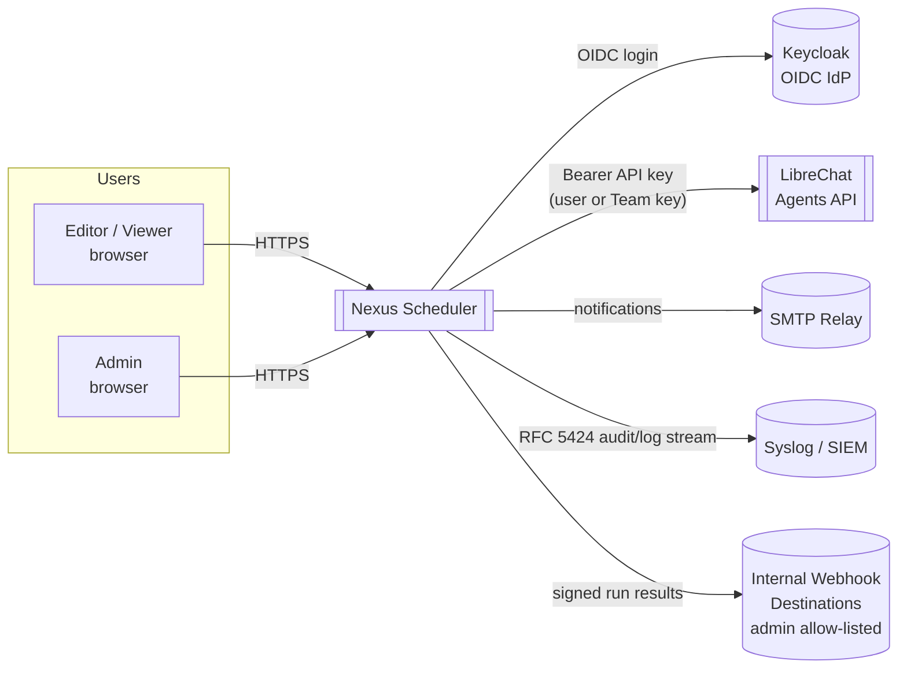
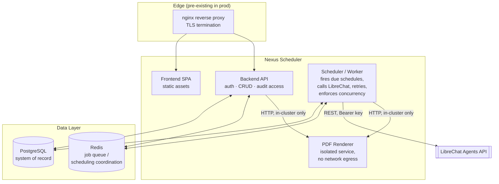
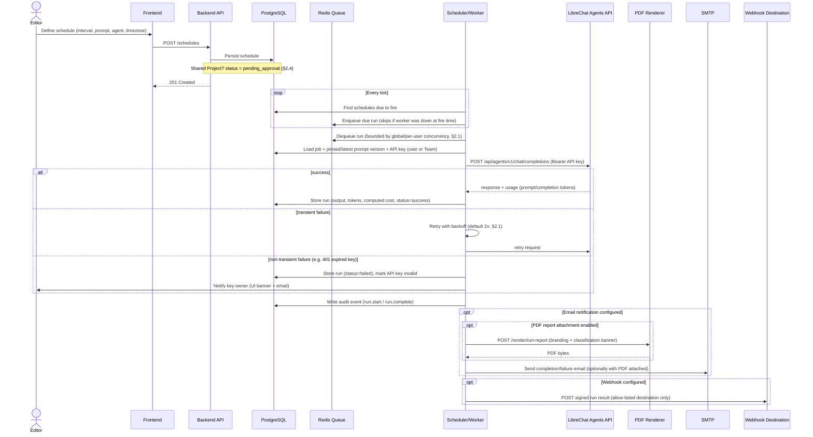
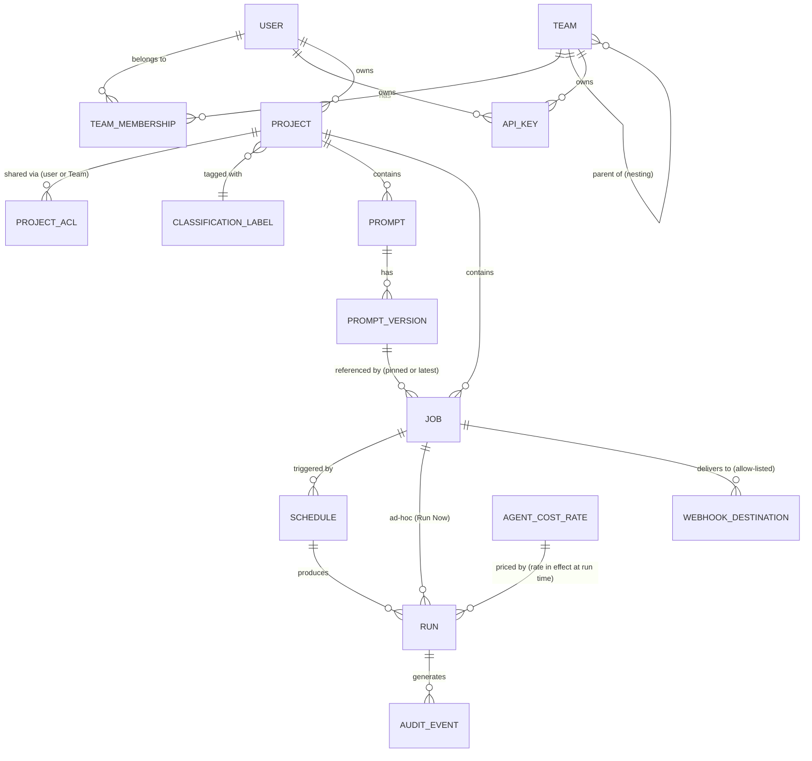
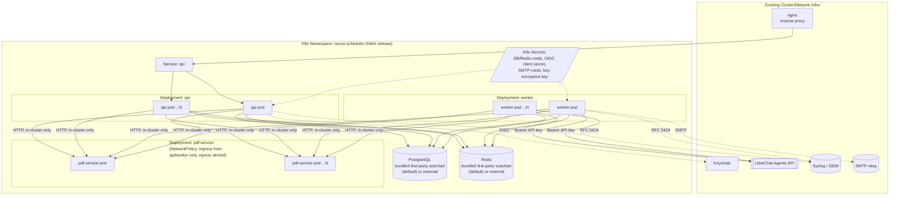
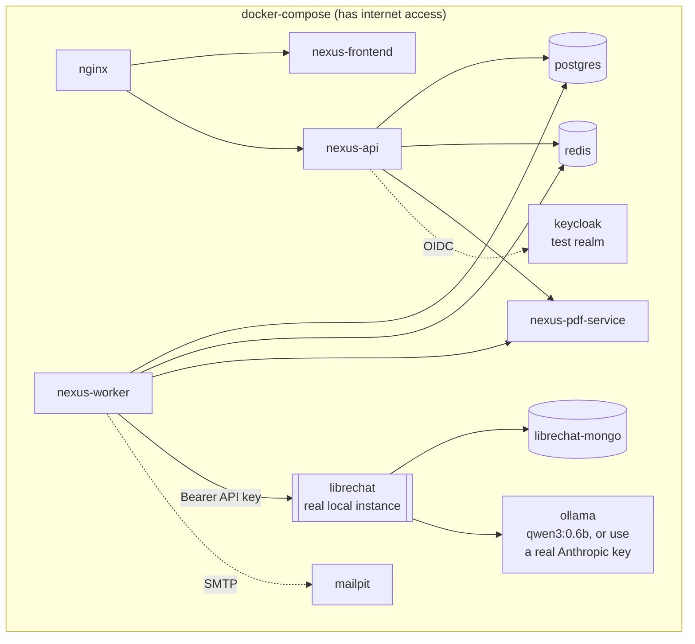
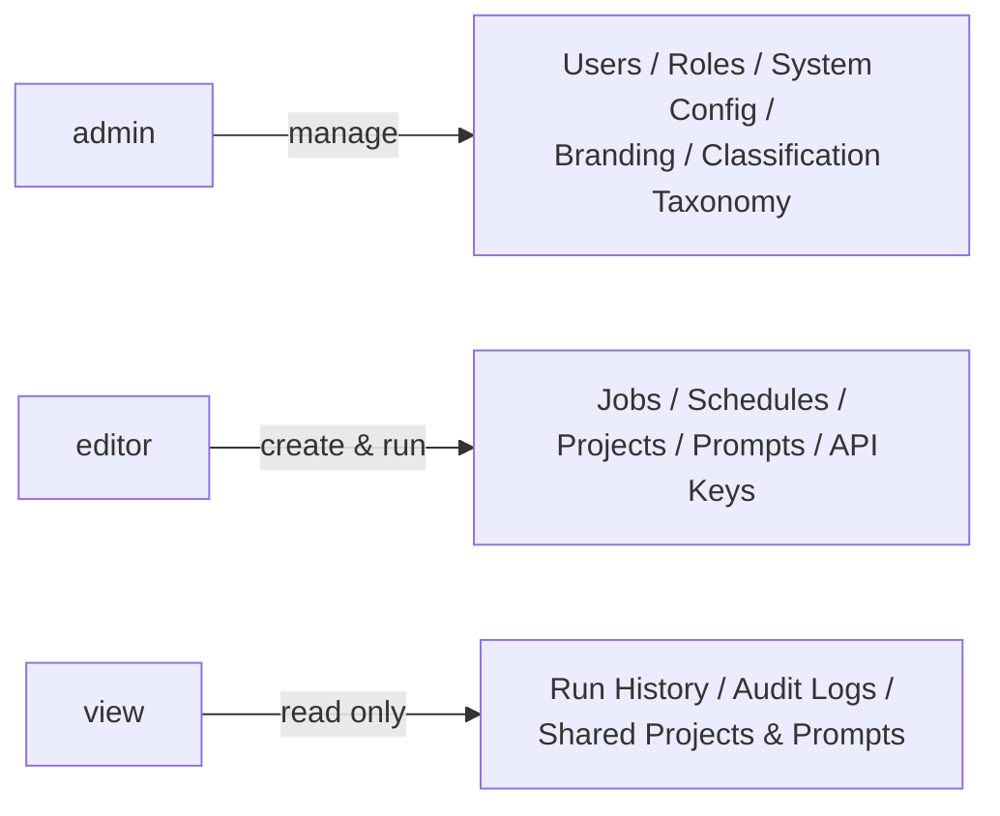

# Nexus Scheduler — Architecture

This document visualizes the system structure described in
[REQUIREMENTS.md](./REQUIREMENTS.md). It captures the working technical
direction (still draft, see REQUIREMENTS.md §11) as diagrams rather than
prose — the "why" behind each decision lives in REQUIREMENTS.md; this file
is the "what it looks like."

Diagrams are [Mermaid](https://mermaid.js.org/) and render natively on
GitHub/GitLab.

## 1. System Context

Who and what Nexus Scheduler talks to, at the boundary of the deployment.

Everything above the dotted line in later diagrams runs **inside** the
air-gapped Government network. LibreChat, Keycloak, SMTP, SIEM, and
webhook destinations are all internal services on that same network —
nothing here reaches the public internet at runtime (REQUIREMENTS.md §3).

## 2. Containers / Runtime Components

**Why API and Worker are separate containers**: the API serves interactive
UI traffic; the Worker runs due schedules concurrently and must scale
independently (horizontally, via replica count) as job volume grows,
without affecting UI responsiveness. Redis is the coordination point
between them — see REQUIREMENTS.md §2.1 and §11.

**Why the PDF Renderer is its own service, not a library**: it's the only
component that launches a headless browser (REQUIREMENTS.md §2.5 calls
for full isolation — its own pod, no network egress, independent crash-
restart), so it's split out rather than linked into API/Worker directly.
Both call it over HTTP; a `NetworkPolicy` (§5 below) enforces that only
API/Worker pods can reach it and that it can reach nothing outbound.

### Component responsibilities

| Component | Responsibility |
|---|---|
| Frontend (SPA) | Job/schedule/Project/Team UI, Prompt Library, admin settings, classification banner rendering |
| Backend API | AuthN/AuthZ (OIDC + local), CRUD for jobs/schedules/Projects/Teams/prompts, audit log access, approval queue, reporting endpoints, on-demand PDF download (via the PDF Renderer service) |
| Scheduler/Worker | Polls due schedules, enqueues/dequeues runs respecting concurrency limits, calls LibreChat, retries, computes cost, sends notifications/webhooks/emailed PDF reports (via the PDF Renderer service), writes audit events, and sends a recurring admin usage-report email on its own schedule |
| PDF Renderer | `packages/pdf-service` — an isolated internal-only service (headless Chromium via Playwright) that renders run reports and the admin usage report to PDF on request from the API or Worker over HTTP. No inbound route from outside the cluster, no outbound network access at all (REQUIREMENTS.md §2.5) |
| PostgreSQL | System of record: see §5 data model |
| Redis | Job queue + scheduling coordination across Worker replicas |
| nginx | TLS termination + reverse proxy (pre-existing in prod; included in Compose for local parity) |

## 3. Job Execution Flow

The core operational loop: a schedule fires, a job runs against LibreChat,
and the result is stored, audited, and optionally delivered.

## 4. Data Model (Illustrative)

Not a final schema — shows the key entities and relationships implied by
REQUIREMENTS.md (§2–§8).

Key fields worth calling out explicitly (full detail in REQUIREMENTS.md):

- `RUN`: `trigger_type` (scheduled/manual), `status`, `prompt_tokens`,
  `completion_tokens`, `computed_cost`, `output`, timing fields. Token
  fields are populated from whichever of LibreChat's two observed
  `usage` shapes the underlying provider returns (OpenAI-style
  `prompt_tokens`/`completion_tokens`, or Anthropic-style
  `input_tokens`/`output_tokens`).
- `SCHEDULE`: `timezone` (IANA), `paused`, `approval_status`,
  `version_pin_mode` (pinned vs. always-latest).
- `TEAM_MEMBERSHIP`: an `is_owner` flag — a Team can have one or more
  owners, distinct from ordinary members, who alone (plus admins) can
  rename/delete the Team or manage its membership.
- `PROJECT`: `owner_id` is transferable after creation (owner- or
  admin-only) via a dedicated endpoint, not the general Project-edit
  path, so an edit-level collaborator can never grant themselves
  ownership.
- `AUDIT_EVENT`: see the proposed schema in REQUIREMENTS.md §7.1.

## 5. Deployment Topology — Kubernetes (Production)

- Images relocatable to an internal/offline registry (REQUIREMENTS.md §3).
- Runs in FIPS mode end to end (REQUIREMENTS.md §10).
- `/healthz` and `/metrics` on all three Deployments (api, worker,
  pdf-service — REQUIREMENTS.md §10, §11).
- PostgreSQL/Redis are bundled by default as minimal first-party Helm
  subcharts (`helm/nexus-scheduler/charts/{postgresql,redis}`) so a
  default install needs no external dependency or network access to
  stand them up; either can be swapped for an externally-managed
  instance via a values toggle.
- The LibreChat connection supports a custom CA bundle
  (`librechat.tls.caBundle`) for environments where LibreChat's
  certificate chains to an internal CA, and a TLS-validation-bypass
  escape hatch for testing (`librechat.tls.insecureSkipVerify`).
- `pdf-service` is the only component this chart applies a
  `NetworkPolicy` to so far — everything else (api/worker/frontend/
  postgresql/redis) has none defined yet (see §8).

## 6. Deployment Topology — Docker Compose (Local Dev/Test)

- All secrets/keys **randomly generated at compose-up** (REQUIREMENTS.md
  §9.2) — no committed defaults.
- Exists purely to exercise Nexus Scheduler itself; does not attempt to
  simulate the air-gapped constraint.

## 7. Roles at a Glance

Full role/permission detail: REQUIREMENTS.md §4.

## 8. Open Items Affecting Architecture

- **LibreChat `usage` response shape**: REQUIREMENTS.md §14 still lists
  live confirmation against the target LibreChat deployment as open. The
  `RUN` entity impact (§4) is no longer blocked on that answer either
  way — the Worker now recognizes both the OpenAI-style and
  Anthropic-style shapes LibreChat is known to pass through depending on
  the underlying provider — but a live check is still worth doing to
  catch a third shape neither branch handles.
- **Cluster-wide `NetworkPolicy` posture**: only `pdf-service` (§5) has
  one so far, scoped narrowly to the specific isolation requirement
  REQUIREMENTS.md §2.5 calls out for it. api/worker/frontend/postgresql/
  redis have no `NetworkPolicy` yet — broadening that posture is a
  separate piece of work if a security review calls for it.
- **Non-root UID for the bundled PostgreSQL/Redis subcharts**: both
  currently run as their upstream images' default user rather than a
  hardened non-root UID, deferred until a real cluster is available to
  validate the resulting boot behavior against (REQUIREMENTS.md §3/§9.1/
  §10's broader hardening baseline).
