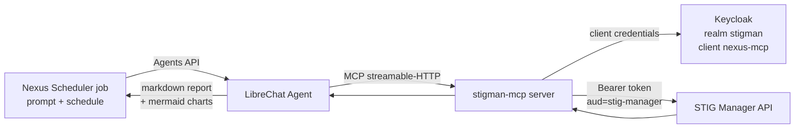

# STIG Manager MCP — scheduled compliance reports from Nexus Scheduler

This example gives a LibreChat Agent a set of **MCP tools backed by
[STIG Manager](https://github.com/NUWCDIVNPT/stig-manager)**, so a
Nexus Scheduler job can run on a schedule and produce a markdown STIG
compliance report — tables plus mermaid charts, rendered in the run
output and exportable as PDF — from live STIG Manager data.

It is written to be **transferable to an air-gapped environment**:
every image is pinned, nothing downloads at runtime, and every
configuration step (Keycloak client, STIG Manager grants, LibreChat
wiring, scheduler artifacts) is spelled out so it can be repeated
against your production Keycloak and STIG Manager rather than the lab.



Two identities are involved, and they never mix:

- **The MCP service account** (`nexus-mcp`, a confidential Keycloak
  client): how the MCP server reads STIG Manager. STIG Manager sees it
  as the user `nexus-mcp` and authorizes it per
  collection through ordinary grants — so what a scheduled report can
  see is controlled in STIG Manager, not in code.
- **Your LibreChat API key**: how Nexus Scheduler calls the Agent, same
  as any other job.

Directory layout:

```
stigman-mcp/
├── README.md                 <- you are here
├── docker-compose.yml        <- lab: Keycloak + STIG Manager 1.5.9 + MCP server
├── .env.example              <- copy to .env, fill in secrets
├── keycloak/realm-import/
│   └── stigman-realm.json    <- realm, clients, scopes, stigadmin user
├── server/
│   ├── server.py             <- the MCP server (Python, streamable-HTTP)
│   ├── test_server.py
│   ├── requirements.txt
│   └── Dockerfile
├── librechat/
│   └── mcp-snippet.yaml      <- block to add to docker/librechat/librechat.yaml
└── prompts/
    ├── stig-posture-report.md      <- per-collection report (Nexus Scheduler prompt)
    ├── stig-fleet-summary.md       <- all-collections summary (Nexus Scheduler prompt)
    ├── stig-quick-check.md         <- one-tool smoke test (first thing to run)
    ├── stig-update-reviews.md      <- FUTURE: bulk-update review results (needs write tools)
    └── stig-mark-not-a-finding.md  <- FUTURE: close checks as Not a Finding (needs write tools)
```

The MCP tools (all read-only): `whoami`, `list_collections`,
`collection_metrics`, `asset_metrics`, `stig_metrics`, `findings`.

---

## Prerequisites

- Docker with Compose v2.
- The main Nexus Scheduler compose stack from the repo root (`docker
  compose up -d`) if you want the full loop through LibreChat and the
  scheduler; Parts 1–4 need only this directory.
- Ports 8180, 54000, and 8005 free on the host.

## Part 1 — Start the lab (Keycloak + STIG Manager + MCP)

```bash
cd MCPs/stigman-mcp
cp .env.example .env
# fill in every value; generate secrets with: openssl rand -hex 24
docker compose up -d --build
docker compose ps          # wait until everything is healthy
```

What comes up:

| Service | URL (host) | Notes |
|---|---|---|
| Keycloak | http://localhost:8180 | admin console: `KEYCLOAK_ADMIN` / `KEYCLOAK_ADMIN_PASSWORD` |
| STIG Manager | http://localhost:54000 | log in via Keycloak as `stigadmin` / `STIGMAN_ADMIN_PASSWORD` |
| MCP server | http://localhost:8005/mcp | streamable-HTTP MCP endpoint |

All three host ports are defaults, overridable from `.env`
(`KEYCLOAK_HOST_PORT`, `STIGMAN_HOST_PORT`, `MCP_HOST_PORT`) if they
collide with something already running — the realm import's redirect
URIs and STIG Manager's browser-facing issuer follow along
automatically.

**Keycloak URLs.** Keycloak is deliberately started without
`KC_HOSTNAME`, so the token issuer follows the request host: browsers
see `http://localhost:8180/realms/stigman`, containers see
`http://keycloak:8080/realms/stigman`. STIG Manager fetches its
signing keys from the *internal* URL (`STIGMAN_OIDC_PROVIDER`) and
validates tokens by signature and `aud` — both issuers share the same
keys, so tokens minted on either side of the network verify. What must
match each side is *reachability*: the MCP server requests tokens from
the internal token URL, browsers from the host one. In production you
will have one canonical HTTPS hostname instead and set `KC_HOSTNAME`.

## Part 2 — The Keycloak client (what the realm import created, and how to repeat it manually)

The lab imports `keycloak/realm-import/stigman-realm.json`
automatically (secrets are substituted from `.env` via Keycloak's
`${VAR}` placeholder mechanism). **On a production / air-gapped
Keycloak you will add the client to your existing realm by hand** —
these are the exact settings, in UI terms.

(One import-file detail you can ignore in production: the realm JSON
declares explicit `preferred_username` and `realm_access.roles`
protocol mappers on the web client, because a realm import that
defines its own `clientScopes` suppresses Keycloak's built-in scopes.
An existing realm already has the built-ins and needs nothing extra.)

1. **Client scopes** (Keycloak admin → your realm → *Client scopes* →
   *Create client scope*), one per name, protocol **openid-connect**,
   type **None**, *Include in token scope* **on**:
   `stig-manager:stig`, `stig-manager:stig:read`,
   `stig-manager:collection`, `stig-manager:collection:read`,
   `stig-manager:user`, `stig-manager:user:read`, `stig-manager:op`.
   (If STIG Manager already runs against this realm, these exist.)
2. **Client** (*Clients* → *Create client*):
   - Client ID: `nexus-mcp`
   - Client authentication: **on** (confidential)
   - Authentication flows: **only** *Service accounts roles* (client
     credentials). Standard flow and direct access grants **off** — this
     client never logs a human in.
   - After saving, copy the **Credentials → Client Secret**; this is
     `NEXUS_MCP_CLIENT_SECRET` for the MCP server.
3. **Assign the scopes** (*Clients* → `nexus-mcp` → *Client scopes* →
   *Add client scope* → add as **Default**): the read scopes it needs —
   `stig-manager:stig:read`, `stig-manager:collection:read`,
   `stig-manager:user:read`, `stig-manager:op`. Least privilege: the
   report tools are read-only, so the write scopes are never granted.
4. **Audience mapper** (*Clients* → `nexus-mcp` → *Client scopes* →
   `nexus-mcp-dedicated` → *Add mapper → By configuration → Audience*):
   Name `stig-manager-audience`, *Included Custom Audience* =
   `stig-manager`, *Add to access token* **on**. Without this, a STIG
   Manager configured with `STIGMAN_JWT_AUD_VALUE=stig-manager`
   (recommended, and what the lab does) rejects the token.

Sanity-check the client with nothing but curl (host port in the lab;
your realm URL in production):

```bash
source .env
curl -s -X POST http://localhost:8180/realms/stigman/protocol/openid-connect/token \
  -d grant_type=client_credentials \
  -d client_id=nexus-mcp \
  -d client_secret="$NEXUS_MCP_CLIENT_SECRET" | python3 -m json.tool
```

You should get an `access_token`. Decode its payload
(`cut -d. -f2 | base64 -d`) and confirm it carries
`"aud": "stig-manager"` (or a list containing it) and a `scope` string
containing the `stig-manager:*:read` scopes.

## Part 3 — Authorize the service account in STIG Manager (collection grants)

STIG Manager auto-creates a user record the first time a valid token
arrives, so the order matters: **call the API once as the service
account, then grant it access as an admin.**

1. Make the service account known to STIG Manager (the MCP server does
   this on its first tool call, but doing it explicitly is clearer):

   ```bash
   TOKEN=$(curl -s -X POST http://localhost:8180/realms/stigman/protocol/openid-connect/token \
     -d grant_type=client_credentials -d client_id=nexus-mcp \
     -d client_secret="$NEXUS_MCP_CLIENT_SECRET" | python3 -c 'import sys,json;print(json.load(sys.stdin)["access_token"])')
   curl -s http://localhost:54000/api/user -H "Authorization: Bearer $TOKEN" | python3 -m json.tool
   ```

   The response is the service account's own user record. Note the
   `username`: **`nexus-mcp`** — with no username claim in a
   client-credentials token, STIG Manager falls back to the `azp`
   claim, so the service account appears under the client ID itself.

2. Log into STIG Manager at http://localhost:54000 as `stigadmin`
   (password: `STIGMAN_ADMIN_PASSWORD` from `.env` — the realm import
   gave this user the `admin` and `create_collection` privileges).

3. Create a collection if you have none yet (*Create Collection…*),
   add an asset or two and assign STIGs to them (STIG benchmarks are
   imported under *Application Management → STIG Benchmarks* from
   [DISA XCCDF files](https://public.cyber.mil/stigs/downloads/) — in
   an air-gapped environment these come across on the same media as
   the images).

4. Grant the service account on the collection: open the collection →
   **Manage** → **Grants** → *Add Grant* → user
   `nexus-mcp`, access level **Restricted** or
   **Full** (read-only reporting needs no more than Full; *Manage* and
   *Owner* would let it change the collection — don't). Repeat per
   collection you want in reports: **a collection the service account
   is not granted on simply does not exist in its reports**, which is
   the access-control model working as intended.

5. Verify what the reports will see:

   ```bash
   curl -s http://localhost:54000/api/collections -H "Authorization: Bearer $TOKEN" | python3 -m json.tool
   ```

## Part 4 — Verify the MCP server itself

The server container was built and started in Part 1. Exercise the MCP
endpoint directly (streamable-HTTP is plain JSON-RPC over POST; the
`Accept` header must offer both content types):

```bash
MCP=http://localhost:8005/mcp
H1='Content-Type: application/json'
H2='Accept: application/json, text/event-stream'

# 1. initialize
curl -s $MCP -H "$H1" -H "$H2" -d '{"jsonrpc":"2.0","id":1,"method":"initialize","params":{"protocolVersion":"2025-03-26","capabilities":{},"clientInfo":{"name":"curl","version":"0"}}}'

# 2. list the tools
curl -s $MCP -H "$H1" -H "$H2" -d '{"jsonrpc":"2.0","id":2,"method":"tools/list"}'

# 3. call one — this proves Keycloak auth + STIG Manager reachability end to end
curl -s $MCP -H "$H1" -H "$H2" -d '{"jsonrpc":"2.0","id":3,"method":"tools/call","params":{"name":"list_collections","arguments":{}}}'
```

Responses arrive as `event: message` / `data: {...}` SSE lines; the
`data:` line is the JSON-RPC response. Step 3 returning your granted
collections means the whole auth chain works. (`whoami` is the
equivalent in-agent debugging tool.)

## Part 5 — Wire LibreChat to the MCP server, and create the Agent

This uses the main Nexus Scheduler compose stack from the repo root.

1. **Networking** — LibreChat must reach the MCP server. Two options
   (both in [librechat/mcp-snippet.yaml](./librechat/mcp-snippet.yaml)):
   - *Same host, Docker Desktop:* use
     `http://host.docker.internal:8005/mcp` (the lab publishes 8005).
   - *Anywhere, including Linux/air-gap:* attach the librechat
     container to the lab network
     (`docker network connect stigman-mcp-lab_stigman-lab librechat`)
     and use `http://stigman-mcp:8005/mcp`.

2. **Config** — add the `mcpServers` block from
   [librechat/mcp-snippet.yaml](./librechat/mcp-snippet.yaml) to
   `docker/librechat/librechat.yaml` (top level, a sibling of
   `endpoints:`). What it looks like in place:

   ```yaml
   # docker/librechat/librechat.yaml
   mcpServers:
     stigman:
       type: streamable-http
       url: http://host.docker.internal:8005/mcp   # or http://stigman-mcp:8005/mcp on a shared network
       timeout: 60000
   # Required: LibreChat's SSRF protection blocks MCP URLs that resolve
   # to private addresses unless the exact host:port is exempted.
   mcpSettings:
     allowedAddresses:
       - "host.docker.internal:8005"

   endpoints:
     custom:
       ...
   ```

   The agent also needs a model that can actually call tools. The
   bundled small local models cannot, and this was tested the hard way:
   **Mistral 7B advertises tool support but never emitted a single tool
   call through the ollama → LiteLLM → LibreChat Agents path** — runs
   "succeed" with empty output while the MCP server logs zero
   CallToolRequests. The working fully-local choice is **Llama 3.1 8B**,
   the canonical ollama function-calling model. Add it to
   `docker/litellm/config.yaml` and pull the weights:

   ```yaml
   # docker/litellm/config.yaml (model_list) — add:
   - model_name: llama3.1:8b
     litellm_params:
       model: ollama_chat/llama3.1:8b
       api_base: http://ollama:11434
   ```

   ```bash
   docker compose exec ollama ollama pull llama3.1:8b   # 4.9 GB, once
   docker compose restart litellm
   ```

   CPU-only inference is slow — give jobs a generous timeout (1800 s)
   and expect minutes per report. If the deployment is allowed hosted
   models, `ANTHROPIC_API_KEY` in the root `.env` unlocks
   `claude-sonnet` through the same gateway: seconds instead of minutes
   and far more reliable multi-step tool use. Air-gapped: transfer the
   llama3.1 weights on media (`ollama pull` online, copy the ollama
   volume or use a private registry).

   *Alternative — no yaml server definition:* current LibreChat builds
   have an **MCP Servers** panel (side panel) where an admin account can
   create the server in the UI instead — stored in LibreChat's database,
   no restart, shareable with other users (`interface.mcpServers.create:
   true` opens creation to non-admins). The `mcpSettings.allowedAddresses`
   exemption stays in the yaml either way — it is admin security policy,
   deliberately not settable from the UI. Prefer the yaml definition for
   production/air-gap (declarative, versioned, survives a database
   reset); the UI is ideal for iterating. Then
   `docker compose restart librechat`. On success the librechat log
   shows the `stigman` MCP server initializing with 6 tools.

3. **Create the Agent** in the LibreChat UI:
   1. Open LibreChat → side panel → **Agents** → *Create Agent* (agents
      require an account with agent-creation permission — the default
      in this stack).
   2. Name: `STIG Compliance Analyst`.
   3. Model: pick a tool-capable model from the gateway list —
      `llama3.1:8b` for fully-local (see the model note in step 2;
      Mistral 7B looks tool-capable but is not through this path), or
      `claude-sonnet` when a hosted key is configured. **Tool calling
      quality matters more than usual here** — the report is a
      multi-step tool workflow, so start every new model with the
      `STIG quick check` prompt (one tool call) before trusting it
      with the full reports.
   4. Instructions (system prompt) — keep it short; the per-run detail
      lives in the Nexus Scheduler prompt:
      > You are a STIG compliance reporting agent. Use the stigman MCP
      > tools to read live data; never invent numbers. If a tool
      > errors, quote the error. Output clean markdown; put charts in
      > mermaid code fences.
   5. **Tools**: *Add Tools* → enable the `stigman` MCP tools
      (`whoami`, `list_collections`, `collection_metrics`,
      `asset_metrics`, `stig_metrics`, `findings`). Set *Max Agent
      Steps* to at least 10 so a fleet report can call
      `collection_metrics` once per collection.
   6. Save. Test it in chat: "Call whoami and list_collections and
      summarize what you can see." — you should watch the tools fire.

## Part 6 — The Nexus Scheduler artifacts (API key, Project, Prompts, Job, Schedule)

In the Nexus Scheduler UI (the app from the repo root stack):

1. **API key** — LibreChat → **Settings → API Keys** → create a key
   (durable `sk-…`, shown once). In Nexus Scheduler → **API Keys** →
   *Add*, paste it. This is normal scheduler setup — the MCP part
   changes nothing here.
2. **Project** — **Projects** → *Create*: name `STIG Compliance
   Reporting`, description "Scheduled STIG posture reports from STIG
   Manager via the stigman MCP agent". Share it with your team at
   *read* so reports are visible but prompts aren't editable by
   everyone (schedules in a shared project go through approval —
   that's intended governance for unattended runs).
3. **Prompts** — inside the project create three prompts, pasting the
   bodies from this directory verbatim:
   - `STIG quick check` ← [prompts/stig-quick-check.md](./prompts/stig-quick-check.md).
     One tool call, one table, one pie chart — run this FIRST whenever
     you change the model or the wiring; it separates "the chain works"
     from "the model can sustain a long report". Variables:
     `collection_id`, `collection_name`. Full body, for reference:

     ~~~markdown
     Call the `collection_metrics` tool with collection_id "{{collection_id}}". Use only numbers from the tool result — never invent any.

     Then output exactly this markdown structure:

     # STIG Quick Check — {{collection_name}} — {{date}}

     One sentence: how many of the total checks are assessed (assessed / assessments, assessedPct%).

     ## Open findings
     A markdown table with two columns (Severity, Count) and three rows: CAT I = findings.high, CAT II = findings.medium, CAT III = findings.low.

     ## Results
     A mermaid pie chart in a ```mermaid fence titled "Check results" with slices Pass, Fail, Not Applicable, and Unassessed (assessments minus assessed). Nothing but valid mermaid inside the fence.
     ~~~
   - `STIG posture report` ← [prompts/stig-posture-report.md](./prompts/stig-posture-report.md).
     It uses a `{{collection_name}}` variable, so one prompt serves any
     collection; `{{date}}` is a built-in and resolves automatically.
   - `STIG fleet summary` ← [prompts/stig-fleet-summary.md](./prompts/stig-fleet-summary.md).
     No variables — it reports every collection the service account
     can see.

   Two more prompt files ship for a workflow this example deliberately
   does **not** enable: write operations.
   [prompts/stig-update-reviews.md](./prompts/stig-update-reviews.md)
   bulk-updates review results for named rules, and
   [prompts/stig-mark-not-a-finding.md](./prompts/stig-mark-not-a-finding.md)
   closes specific checks as "Not a Finding" (compliant) with a recorded
   rationale. Both name tools (`update_review`, `submit_review`) that do
   not exist in the read-only server, and each file's header comment
   lists the three things enabling them requires (the write tool in
   server.py, the `stig-manager:collection` write scope on the
   `nexus-mcp` client, and a deliberate decision about the service
   account's grant). Keep them unattached to any job until then.
4. **Jobs** — inside the project, *Create Job*:
   - `Weekly posture report — <collection>`: prompt `STIG posture
     report`, agent `STIG Compliance Analyst` (discovered once the API
     key is selected), your API key, timeout ≥ 300 s (a multi-tool
     report is slower than a chat reply), retries 1.
   - `Daily fleet summary`: prompt `STIG fleet summary`, same agent
     and key.
5. **Run it** — *Run Now* on a job. The run output renders the
   markdown report, mermaid charts included; **PDF** on the run
   exports it. Set the `{{collection_name}}` variable value on the
   job/schedule for the posture report.
6. **Schedule it** — add a schedule (e.g. fleet summary daily 06:00,
   posture report Mondays 06:30, in your timezone). In the shared
   project the schedule waits for approval by another editor — after
   that, reports arrive on cadence, with run history, cost tracking,
   and (optionally) email/webhook notifications like any other job.

## Air-gap transfer checklist

Everything crosses on media once; nothing downloads on the inside.

1. **Images** (build/pull online, then `docker save` → media →
   `docker load`):
   - `stigman-mcp:1.0.0` (built here — `docker compose build`)
   - `nuwcdivnpt/stig-manager:1.5.9`, `mysql:8.0.46`,
     `quay.io/keycloak/keycloak:26.6.4`, `postgres:16.14-alpine`
     (skip any your environment already runs)
2. **This directory** — realm JSON, compose file, prompts, snippet.
3. **DISA STIG benchmark XCCDF files** for STIG Manager.
4. On the inside: `docker load` the images, recreate `.env` with
   locally generated secrets (never carry secrets across on media),
   then follow Parts 2–6 against your production Keycloak/STIG Manager
   URLs. The only URL-shaped configuration is environment variables on
   the MCP container (`STIGMAN_API_URL`, `KEYCLOAK_TOKEN_URL`) and the
   `mcpServers` URL in librechat.yaml.

## Troubleshooting

### The STIG Manager connection, step by step

When reports come back empty or erroring, walk the client's auth chain
in order — each step isolates one link, and the first one that fails
names the problem. Run these from the host against the lab (substitute
your production URLs inside the real environment):

```bash
cd MCPs/stigman-mcp && source .env

# 1. Keycloak reachable + client credentials valid?  (expect: JSON with access_token)
TOKEN=$(curl -s -X POST http://localhost:8180/realms/stigman/protocol/openid-connect/token \
  -d grant_type=client_credentials -d client_id=nexus-mcp \
  -d client_secret="$NEXUS_MCP_CLIENT_SECRET" | python3 -c 'import sys,json;print(json.load(sys.stdin)["access_token"])')

# 2. Token carries what STIG Manager checks?  (expect: aud=stig-manager + the :read scopes)
echo "$TOKEN" | cut -d. -f2 | python3 -c 'import sys,base64,json;p=sys.stdin.read().strip();p+="="*(-len(p)%4);d=json.loads(base64.urlsafe_b64decode(p));print("aud:",d.get("aud"));print("scope:",d.get("scope"))'

# 3. STIG Manager accepts the token?  (expect: the nexus-mcp user record; 401 here = aud/JWKS, see table)
curl -s http://localhost:54000/api/user -H "Authorization: Bearer $TOKEN" | python3 -m json.tool

# 4. Grants in place?  (expect: your collections; [] = valid auth but no grants yet — Part 3.4)
curl -s http://localhost:54000/api/collections -H "Authorization: Bearer $TOKEN"

# 5. Same checks from INSIDE the MCP container (network path the server actually uses):
docker compose exec stigman-mcp python -c "import httpx,os; \
  r=httpx.post(os.environ['KEYCLOAK_TOKEN_URL'],data={'grant_type':'client_credentials','client_id':os.environ['OIDC_CLIENT_ID'],'client_secret':os.environ['OIDC_CLIENT_SECRET']}); print('token:',r.status_code); \
  t=r.json()['access_token']; \
  r2=httpx.get(os.environ['STIGMAN_API_URL']+'/user',headers={'Authorization':'Bearer '+t}); print('stigman:',r2.status_code, r2.json().get('username'))"

# 6. The MCP wire itself (what LibreChat speaks):
curl -s http://localhost:8005/mcp -H 'Content-Type: application/json' \
  -H 'Accept: application/json, text/event-stream' \
  -d '{"jsonrpc":"2.0","id":1,"method":"tools/call","params":{"name":"whoami","arguments":{}}}'
```

Steps 1–4 passing on the host but step 5 failing means a container
networking/env problem (wrong `KEYCLOAK_TOKEN_URL`/`STIGMAN_API_URL`
values, or the containers aren't on a shared network). All six passing
but reports still empty means the problem is on the LibreChat/agent
side — check that the librechat log lists the six stigman tools at
startup, and that the MCP server logs `CallToolRequest` lines while a
run is executing; a model that never triggers those lines is not
actually calling tools (see the model note in Part 5).

| Symptom | Cause / fix |
|---|---|
| Token request 401 `invalid_client` | Wrong `NEXUS_MCP_CLIENT_SECRET`, or the client has *Client authentication* off. |
| STIG Manager 401, token looks fine | Missing/wrong `aud`: the token must carry `aud=stig-manager` (the audience mapper in Part 2.4) when `STIGMAN_JWT_AUD_VALUE` is set. Decode the token and check. Signature failures mean STIG Manager can't reach `STIGMAN_OIDC_PROVIDER` for JWKS. |
| STIG Manager 403 on a tool | Token lacks the `stig-manager:*:read` scopes (not assigned as **Default** on the client), or the endpoint needs a scope you removed. |
| `list_collections` returns `[]` | Not an error — the service account has no collection grants yet (Part 3.4), or Part 3.1 was skipped so the user doesn't exist to grant. |
| LibreChat log: `Domain "…" is not allowed` for stigman | LibreChat's SSRF protection blocks MCP URLs that resolve to private IPs. Add the exact host:port to `mcpSettings.allowedAddresses` (see the snippet) and restart librechat. |
| LibreChat doesn't list the stigman tools | `mcpServers` block malformed or the URL unreachable from *inside* the librechat container (`docker exec librechat curl -s http://…:8005/mcp` — a 4xx proves reachability; connection refused is the network problem). Restart librechat after config edits. |
| Agent calls tools but the report has invented numbers | Model too weak for multi-step tool use — see the model note in Part 5.3. The prompts instruct the agent to only use tool results; small models ignore that under pressure. |
| Charts don't render in run output | The mermaid fence must contain only mermaid syntax; the prompts pin this down, but models sometimes add prose inside the fence. |

## Production and air-gap notes

- `start-dev` and plain HTTP are **lab-only**. Production Keycloak runs
  `start` with TLS and `KC_HOSTNAME`; STIG Manager and the MCP server
  then use that single HTTPS issuer and the dual-URL note in Part 1
  becomes irrelevant.
- Give the MCP container the CA bundle your Keycloak/STIG Manager TLS
  chains to (mount it and set `SSL_CERT_FILE`) rather than disabling
  verification.
- The MCP server holds one secret (`OIDC_CLIENT_SECRET`). Inject it as
  a real secret (compose `secrets:`, or the Kubernetes equivalent),
  rotate it in Keycloak like any service credential, and remember the
  blast radius is read access to exactly the collections granted in
  Part 3 — nothing else.
- The MCP endpoint itself is unauthenticated HTTP inside the network;
  keep it on an internal network reachable only by LibreChat (the same
  pattern this repo uses for its OCR service), not on a published port,
  outside the lab.
