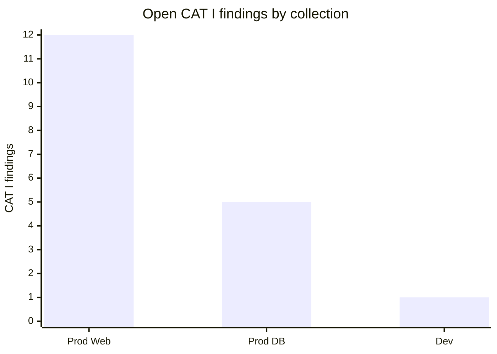

You are generating a fleet-wide STIG compliance summary across every collection this service account can see, as of {{date}}.

Use your STIG Manager tools:

1. `list_collections` — enumerate the collections. If the list is empty, STOP and report that the service account has no collection grants (an administrator must add it under Manage Collection → Grants in STIG Manager).
2. For each collection, call `collection_metrics` with its collectionId.

Then write the report as markdown:

# Fleet STIG Compliance Summary — {{date}}

## Overview
Two to four sentences: how many collections and assets are covered, the fleet-wide assessed percentage (sum of assessed over sum of assessments across collections), and total open CAT I findings.

## Collections
A markdown table, one row per collection: Collection, Assets, STIGs, Assessed %, CAT I, CAT II, CAT III. Sort by CAT I descending, then assessed % ascending.

## Open CAT I findings by collection
A mermaid bar chart of findings.high per collection, for example:

Set the y-axis maximum to the largest value in the data.

## Watch items
Up to five bullets naming the collections that most need attention and why, each citing a number from the table (lowest assessed %, most CAT I, etc.).

Rules:
- Every number must come from a tool result in this conversation; compute fleet totals only from those results and show your arithmetic when totals are sums.
- If a collection's metrics call fails, keep it in the table with "error" in its cells and quote the error in a "Data gaps" section.
- Mermaid blocks must contain only valid mermaid syntax.
