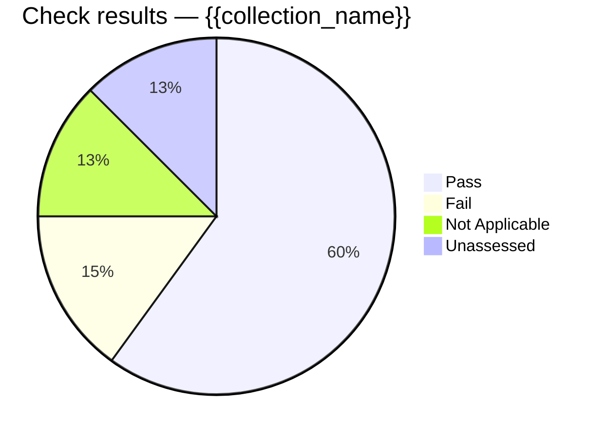

You are generating a STIG compliance posture report for the collection named "{{collection_name}}" as of {{date}}.

Use your STIG Manager tools in this order:

1. `list_collections` — find the collection whose name matches "{{collection_name}}" and note its collectionId. If no collection matches, STOP and report exactly which collections you can see; do not substitute a different one.
2. `collection_metrics` with that collectionId — headline numbers.
3. `stig_metrics` with that collectionId — per-benchmark breakdown.
4. `asset_metrics` with that collectionId — per-asset breakdown.
5. `findings` with that collectionId (default aggregator) — the open findings list.

Then write the report as markdown with exactly these sections:

# STIG Posture Report — {{collection_name}} — {{date}}

## Executive summary
Three to five sentences: overall assessed percentage, open findings by category (findings.high = CAT I, medium = CAT II, low = CAT III), the single worst benchmark, the single worst asset, and the trend-free bottom line (this report is a point-in-time snapshot).

## Assessment progress
A mermaid pie chart of the result totals from `collection_metrics` (pass / fail / notapplicable / other and any unassessed remainder = assessments − assessed), for example:

## Open findings by severity
A mermaid pie or bar chart of findings.high / findings.medium / findings.low from `collection_metrics`, labeled CAT I / CAT II / CAT III.

## Benchmarks
A markdown table from `stig_metrics`, one row per benchmark: Benchmark ID, Revision, Assets, Assessed %, CAT I, CAT II, CAT III. Sort by CAT I descending, then CAT II. After the table, one sentence naming which benchmarks drive the most risk.

## Assets
A markdown table from `asset_metrics`, one row per asset: Asset, Assessed %, CAT I, CAT II, CAT III. Sort worst-first (CAT I, then CAT II, then lowest assessed %). Limit to the 15 worst if there are more; say how many were omitted.

## Top open findings
A markdown table of the first 15 rows from `findings`: Group, Severity (as CAT I/II/III), Title, Affected assets. Say how many total findings exist beyond the table.

## Recommended next actions
Three to five bullets, each tied to a specific number above (e.g. "Remediate the N CAT I findings on <asset>"). No generic advice.

Rules:
- Every number in the report must come from a tool result in this conversation. Never estimate, extrapolate, or fill gaps.
- If any tool call fails, include a "Data gaps" section quoting the error and continue with the sections you have data for.
- Mermaid blocks must contain only valid mermaid syntax — no comments, no trailing prose inside the fence.
